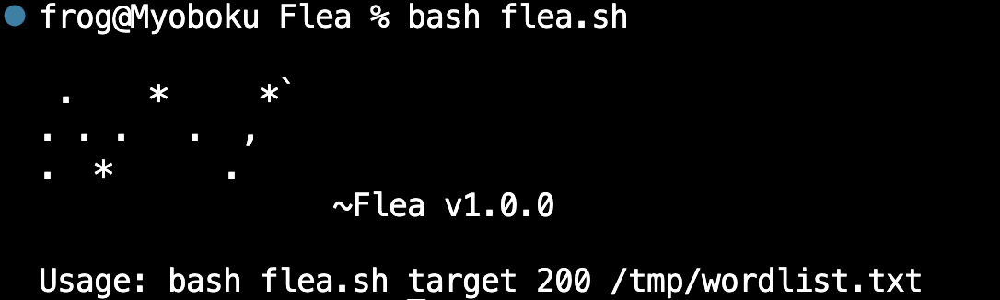
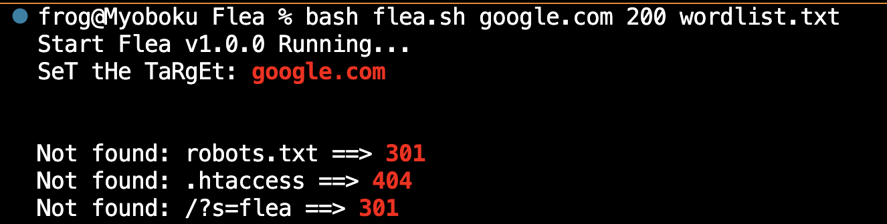
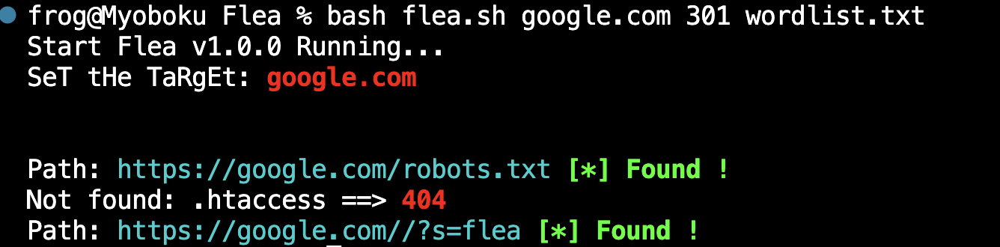

# Flea v1.0.0   
> For flexible probing in aggressive WAFs.   
#    
[](Banner) 
#   
This is a small flexible bash script that can be modified any way you like to fit WAF standards, Ratelimit and  
other defense systems on a target web system.   

I use CURL to perform the requests and SLEEP to bypass the ratelimit, you can add other features to it for  
masking traffic, this is already being devised.   
## Usage:  
```
$ git clone https://Outs1d3r-NET/Flea.git
$ cd Flea
$ chmod a+x flea.sh
$ ./flea.sh tar.get 200 /usr/share/dirb/wordlists/common.txt
```
#   
[](usage01)   
#   
[](usage02)   
#   